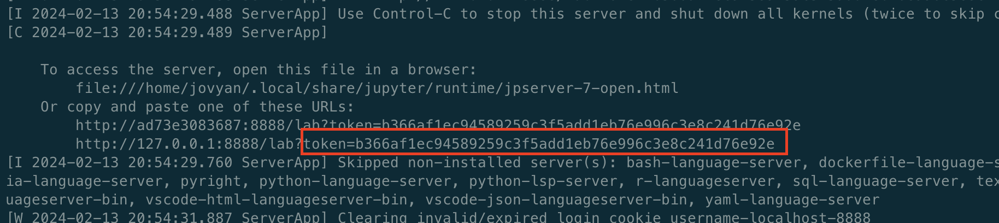
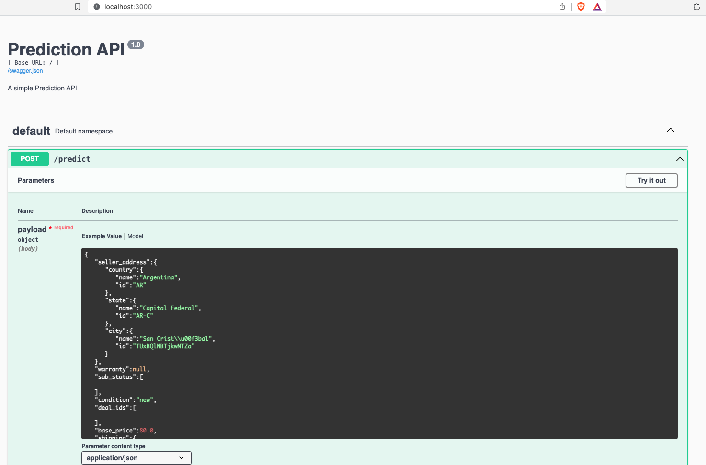

# Challenge de MercadoLibre (MeLi)

Este proyecto incluye un análisis de datos, entrenamiento y selección de modelos, además de un servicio web para probar productos en formato JSON.

## Análisis y Entrenamiento

Todo el análisis de datos, entrenamiento y selección de modelos se realiza en el notebook `notebooks/analysis-and-training.ipynb`.

Puedes ver el documento directamente en github aca [link](https://github.com/so77id/meli-challenge/blob/main/notebooks/analysis-and-training-.ipynb)

O puedes ejecutar el Jupyter Notebook con todos los paquetes necesarios, sigue los siguientes pasos utilizando el `Makefile`:

1. **Inicialización:** Primero, descarga los modelos y la base de datos ejecutando:

    ```
    make init
    ```

2. **Construcción de la Imagen:** Construye la imagen necesaria para correr el notebook:

    ```
    make build
    ```

3. **Ejecución del Jupyter:** Para iniciar Jupyter Notebook, ejecuta:

    ```
    make run-jupyter
    ```

    - **Nota:** Recuerda extraer el token de Jupyter y utilizarlo al ingresar a la página `localhost:8888`.

    

    Pegalo en la pagina
    
    
    

## Servicio Web con Flask

El servicio web está construido con Flask y todo el código fuente se encuentra en la carpeta `src`. Para ejecutarlo, sigue estos pasos:

1. **Descarga de Modelos y Datos:** Si aún no lo has hecho, descarga los modelos y los datos con:

    ```
    make init
    ```

2. **Construcción de Imágenes con Docker Compose:** Construye las imágenes necesarias utilizando:

    ```
    docker compose build
    ```

3. **Ejecución del Servicio:** Inicia el servicio con:

    ```
    docker compose up
    ```

    Luego, puedes acceder a `localhost:3000` donde se abrirá una página de Swagger. Aquí puedes probar el servicio con productos en formato JSON.

### Ejemplo de Uso

Utiliza este JSON para probar cómo funciona el servicio web a través de la interfaz Swagger.



Para probar el servicio, puedes utilizar el siguiente JSON como ejemplo:

```json
{
  "seller_address": {
    "country": {"name": "Argentina", "id": "AR"},
    "state": {"name": "Capital Federal", "id": "AR-C"},
    "city": {"name": "San Cristóbal", "id": "TUxBQlNBTjkwNTZa"}
  },
  "warranty": null,
  "sub_status": [],
  "condition": "new",
  "deal_ids": [],
  "base_price": 80.0,
  "shipping": {
    "local_pick_up": true,
    "methods": [],
    "tags": [],
    "free_shipping": false,
    "mode": "not_specified",
    "dimensions": null
  },
  "non_mercado_pago_payment_methods": [
    {"description": "Transferencia bancaria", "id": "MLATB", "type": "G"},
    {"description": "Acordar con el comprador", "id": "MLAWC", "type": "G"},
    {"description": "Efectivo", "id": "MLAMO", "type": "G"}
  ],
  "seller_id": 8208882349,
  "variations": [],
  "site_id": "MLA",
  "listing_type_id": "bronze",
  "price": 80.0,
  "attributes": [],
  "buying_mode": "buy_it_now",
  "tags": ["dragged_bids_and_visits"],
  "listing_source": "",
  "parent_item_id": "MLA6553902747",
  "coverage_areas": [],
  "category_id": "MLA126406",
  "descriptions": [{"id": "MLA4695330653-912855983"}],
  "last_updated": "2015-09-05T20:42:58.000Z",
  "international_delivery_mode": "none",
  "pictures": [
    {
      "size": "500x375",
      "secure_url": "https://a248.e.akamai.net/mla-s1-p.mlstatic.com/5386-MLA4695330653_052013-O.jpg",
      "max_size": "1200x900",
      "url": "http://mla-s1-p.mlstatic.com/5386-MLA4695330653_052013-O.jpg",
      "quality": "",
      "id": "5386-MLA4695330653_052013"
    },
    {
      "size": "500x375",
      "secure_url": "https://a248.e.akamai.net/mla-s1-p.mlstatic.com/5361-MLA4695330653_052013-O.jpg",
      "max_size": "1200x900",
      "url": "http://mla-s1-p.mlstatic.com/5361-MLA4695330653_052013-O.jpg",
      "quality": "",
      "id": "5361-MLA4695330653_052013"
    }
  ],
  "id": "MLA4695330653",
  "official_store_id": null,
  "differential_pricing": null,
  "accepts_mercadopago": true,
  "original_price": null,
  "currency_id": "ARS",
  "thumbnail": "http://mla-s1-p.mlstatic.com/5386-MLA4695330653_052013-I.jpg",
  "title": "Auriculares Samsung Originales Manos Libres Cable Usb Oferta",
  "automatic_relist": false,
  "date_created": "2015-09-05T20:42:53.000Z",
  "secure_thumbnail": "https://a248.e.akamai.net/mla-s1-p.mlstatic.com/5386-MLA4695330653_052013-I.jpg",
  "stop_time": 1446669773000,
  "status": "active",
  "video_id": null,
  "catalog_product_id": null,
  "subtitle": null,
  "initial_quantity": 1,
  "start_time": 1441485773000,
  "permalink": "http://articulo.mercadolibre.com.ar/MLA4695330653-auriculares-samsung-originales-manos-libres-cable-usb-oferta-_JM",
  "sold_quantity": 0,
  "available_quantity": 1
}
